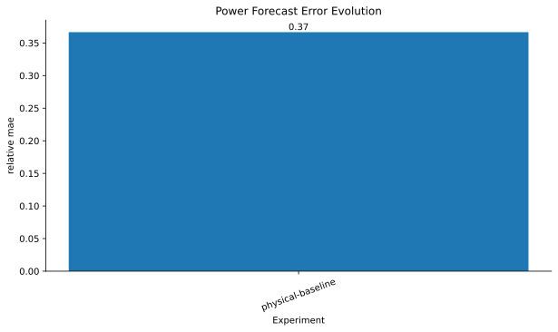

# Energy Management

## Purpose
Exploration project to get an idea of the scope of a software engineer with machine learning tasks
in the field of direct marketing of renewable energies.

## Description
This project is supposed to simulate all the relevant aspects of an energy management platform:

- Forecasts (Energy pricing and production)
- Optimization (risk optimized trading recommendations)
- Event driven architecture
- Independent microservices (simulated in a mono repo)
- REST APIs
- Dashboard (Vue.js + echarts)
- Docker
- Necessary tools to operate the system in a safe and controlled way (Logging, Monitoring, Testing)

## Reached Milestones

- Micro Services communicating via RabbitMQ and REST
- OpenMeteo API implemented
- Structured persistence of forecasts
- First Dashboard with asset map and forecast chart
- First implementation of non-trivial power forecast strategies
- successful reality check/validation of first prediction: plausible results in good range for first shot.
Validation against [BR-PVGen dataset](https://zenodo.org/records/21511487). Prediction in peak times generally within 10%. 
Error metrics to follow.
- reflection on systematic improvement for PV prediction: Inverter types, tracker technologies, bifacial modules, 
diffuse radiation model, shadowing in off-peak-times
- static export of Dashboard UI deployed to [demo server](http://energy-dashboard.soerenparton.de/).
- first step towards uncertainty modeling: [prediction via LGBMRegressor](notebooks/03_uncertainty_modeling.ipynb)
- uncertainty modeling results in asset power forecasts and dashboard charts
- Asset power prediction error metrics for version 1 of physical model: 37% relative MAE (from 25% to 58% depending on 
actual asset). Further investigations derived from errors correlating with assets' metadata

## Next Steps

- Portfolio Aggregation reflecting error correlation of assets
- Wind Asset prediction
- Improving Prediction acccuracy of physical PV model (reflecting inverter types, bifaciality, improving diffuse model)
- energy price prediction

## Architectural Decision Documentation

### Event system

Events describe facts, not required actions

### Forecast update flow

To make sure forecasts are kept up to date, we set up a system made of two parts:
- Asset events communicate (update-) requirements via revision.
- A worker process gathers requirements (both from persisted asset revision and configured freshness conditions),
compares them to the current state and processes necessary updates in a synchronous way.

## Experiment Documentation
### PV Power forecast
